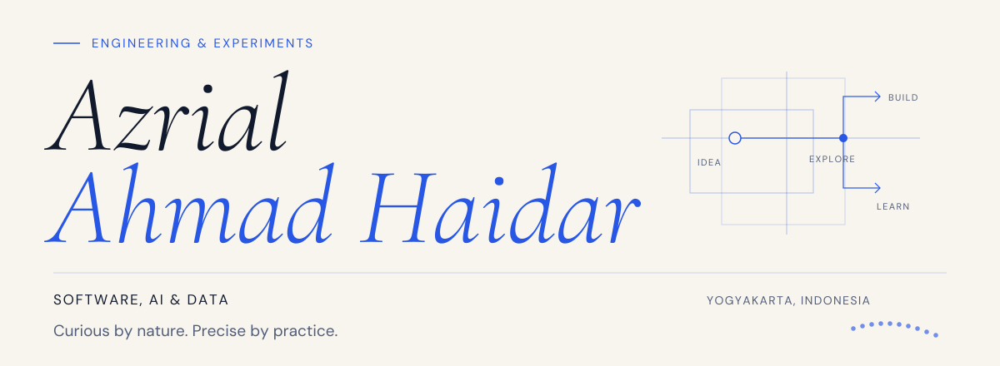

<picture>
  <source media="(prefers-color-scheme: dark)" srcset="./assets/banner-dark.svg">
  <source media="(prefers-color-scheme: light)" srcset="./assets/banner-light.svg">
  
</picture>

[Portfolio ↗](https://azrialahmad.is-a.dev/) &nbsp; / &nbsp; [LinkedIn ↗](https://www.linkedin.com/in/azrialahmad/) &nbsp; / &nbsp; [Email ↗](mailto:azrialahmad@gmail.com)

### Curious by nature. Precise by practice.

I'm **Azrial**, a **CS graduate** based in Yogyakarta, Indonesia. I explore the intersection of **software, AI, and data** — from computer vision experiments and data analysis to APIs and small, useful products.

I've been an avid **LLM user since 2022**, with hands-on experience in **agentic coding workflows**. I enjoy experimenting with how AI can help us build, learn, and make sense of complexity.

- **Now:** Backend Engineer Intern, building experience with real-world software systems.
- **Next:** Apple Developer Academy in **2027**.
- **Exploring:** Applied AI, computer vision, data, and software engineering opportunities.

---

### 01 / Selected work

#### [Gatekeeper · AI Governance Proxy ↗](https://github.com/azrialahmad/ai-governance-proxy)
A gateway between applications and language models, exploring PII redaction, prompt filtering, model routing, response evaluation, and request metrics.

Python · FastAPI · Ollama · Gemini · Groq

#### [Real-time Computer Vision · osu! ↗](https://github.com/azrialahmad/osu-aim-assistant)
A computer vision experiment using a custom-trained YOLOv11 model and GPU-accelerated screen capture to detect gameplay targets in real time.

Python · YOLOv11 · Computer Vision · dxcam

#### [Pixels & Perspectives · Data Analysis ↗](https://github.com/azrialahmad/virtual-photography-analysis)
An analysis of 90+ highly rated virtual photographs, exploring how composition, subject, and game choice relate to audience response.

Python · Pandas · SQL · Jupyter · Matplotlib

#### [Apex Pity Tracker ↗](https://github.com/azrialahmad/apex-pity-tracker)
A browser-only tool that parses official EA data exports to track Apex pack history. Personal data stays on the user's device.

React · JavaScript · Vite · Tailwind CSS &nbsp; [Try it ↗](https://azrialahmad.is-a.dev/apex-pity-tracker/)

**Also built:** Kost marketplace APIs in [Laravel](https://github.com/azrialahmad/mamikos-laravel) and [Spring Boot](https://github.com/azrialahmad/mamikos-springboot), with authentication, ownership checks, search, and transactional credit handling.

---

### 02 / Research

**[A Comparative Analysis of YOLOv12 Model Sizes for Road Damage Detection on an Indonesian Dataset ↗](https://doi.org/10.1109/ICITDA68167.2025.11332249)**

First author · **ICITDA 2025** · Published in **IEEE Xplore** 
Computer vision research comparing YOLOv12 model sizes for road damage detection.

---

### 03 / Technical toolkit

**AI & vision** &nbsp; LLMs · Agentic coding · YOLO · OpenCV · Ollama 
**Data** &nbsp; Python · Pandas · SQL · Jupyter · Matplotlib 
**Software** &nbsp; PHP · Laravel · Java · Spring Boot · FastAPI · JavaScript · React 
**Tools & testing** &nbsp; Git · Linux · Docker · MySQL · PHPUnit

### 04 / Away from the terminal

I run an **Ubuntu homelab on a repurposed old laptop**, giving older hardware a second life and myself a place to tinker.

Away from the screens: street photography and cosplay portraits. Different mediums, same attention to detail. Find the creative side of my work on [my portfolio](https://azrialahmad.is-a.dev/#photography).

---

Curious by nature. Precise by practice. &nbsp; · &nbsp; [Let's connect ↗](mailto:azrialahmad@gmail.com)
